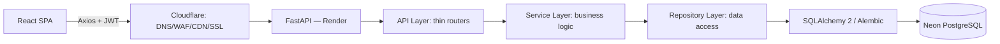

# BioHarvest — Architecture (Phase 0)

## 1. Executive Summary
BioHarvest MVP — e-commerce платформа для продажи биоудобрений в Кыргызстане.
Backend: FastAPI + SQLAlchemy 2.x + Alembic + PostgreSQL (Neon).
Frontend: React + TypeScript + Vite + TanStack Query.
Архитектура — layered (API → Service → Repository → DB), backend — единственный
источник истины для цены, скидки, стока, роли и статуса оплаты.

## 2. Request Flow



## 3. Layer responsibilities

| Layer | Отвечает за | Не отвечает за |
|---|---|---|
| API (routers) | HTTP-парсинг, Pydantic-схемы, вызов сервиса, HTTP-статусы | бизнес-правила, прямой доступ к БД |
| Service | бизнес-логика, транзакции, вызов нескольких repository, идемпотентность | HTTP-детали, SQL |
| Repository | CRUD/queries к конкретной модели, select_related/joinedload | бизнес-правила |
| Core | конфиг, security utils (JWT, hashing), settings из env | — |
| Middleware | CORS, request-id, rate limiting, error handling | бизнес-логика |
| Integrations | будущие внешние сервисы (payment, email, storage) через интерфейсы | — |

Правило: **router не более ~20 строк на эндпоинт**, вся логика — в service.
Authentication проверяется в middleware/dependency, authorization — в service
(конкретное правило зависит от бизнес-контекста, а не только от роли).
Transactions открываются на уровне service (один use case = одна транзакция).
Background jobs (пока не нужны в MVP) будут в отдельном integrations/jobs слое.
Caching — на уровне repository (опционально, только если появится реальная
проблема с производительностью — см. п. "MVP должен быть максимально простым").

## 4. Project structure

```
bioharvest/
├── backend/
│   └── app/
│       ├── api/            # thin routers, v1/
│       ├── core/           # settings, security (jwt/hash), exceptions
│       ├── models/         # SQLAlchemy ORM models
│       ├── schemas/        # Pydantic request/response
│       ├── services/       # business logic, use cases
│       ├── repositories/   # data access per model
│       ├── db/              # session, base, migrations (alembic/)
│       ├── middleware/     # cors, rate limit, error handler, request-id
│       ├── integrations/   # payment provider interface, email, storage
│       └── utils/
├── frontend/
│   └── src/  (см. ARCHITECTURE frontend-раздел)
├── infrastructure/         # docker, nginx (если нужен), deploy scripts
├── docs/
├── tests/
├── .github/workflows/
├── docker-compose.yml
└── README.md
```

Причина разделения `repositories` и `services`: repository не знает про
бизнес-правила (может использоваться разными services), service не знает
про SQL — это упрощает unit-тесты (service тестируется с mock-repository).

## 5. Order flow (high-level)

```
Cart → Checkout request
  → [transaction start]
  → re-fetch current prices/stock from DB (никогда не берём из frontend)
  → validate quantity, promo code
  → reserve stock (row lock, см. STOCK_ARCHITECTURE в DATABASE_DESIGN.md)
  → create Order + OrderItem (цена копируется в OrderItem на момент покупки)
  → create OrderStatusHistory("created")
  → [transaction commit]
  → payment step (COD в MVP — сразу "awaiting_delivery")
```
Повторный (retry) POST /orders с тем же Idempotency-Key возвращает тот же Order,
а не создаёт дубликат — см. раздел Idempotency в API_DESIGN.md.
При ошибке на любом шаге — транзакция откатывается целиком, резерв стока снимается.
При отмене заказа — отдельный use case `cancel_order`, снимающий резерв и
добавляющий `OrderStatusHistory("cancelled")`.

## 6. Frontend architecture

Feature-oriented, разделение server/client/form state:

```
src/
├── app/          # роутинг, providers (QueryClientProvider, AuthProvider)
├── pages/        # страницы, тонкие — собирают features
├── features/     # catalog/, cart/, checkout/, orders/, auth/, admin/...
├── components/   # переиспользуемые UI-примитивы
├── layouts/
├── api/          # axios instance + per-resource api-клиенты
├── hooks/
├── lib/
├── types/
└── utils/
```

- **Server state** (продукты, заказы, корзина с бэка) — TanStack Query.
- **Client/UI state** (открыт ли модал, текущий шаг чекаута) — Zustand или React
  local state — не Zustand для server state.
- **Form state** — React Hook Form + Zod-схемы, переиспользуемые между
  клиентской и (в идеале) той же формой ошибок, что возвращает backend.

Axios instance: единый `baseURL=VITE_API_URL`, request-interceptor добавляет
access token, response-interceptor на 401 делает один refresh и повторяет
запрос — с защитой от параллельных повторных refresh (single in-flight promise)
и без бесконечного цикла (если refresh тоже вернул 401 — logout, redirect).

## 7. Architecture review — что можно упростить

- Redis/Celery — **не включаем в MVP**, пока нет реальной нагрузки или
  фоновой задачи (email отправляется синхронно/через простую очередь в БД).
- Product variants — можно отложить до появления реального товара с вариантами;
  в MVP модель есть, но UI для неё минимальный.
- PromoCode — только фиксированная скидка % или сумма, без сложных правил
  стекинга — сложные правила это Future.
- Admin UI на первых порах может быть таблично-простым (без графиков) —
  графики аналитики это не MVP-критично.
- Самый большой риск переусложнения — попытка сразу спроектировать B2B
  и recommendation-модели "на будущее" в MVP-схемах. Решение: они не
  создаются как таблицы сейчас, только упомянуты в ROADMAP.md, чтобы
  не блокировать миграции.
