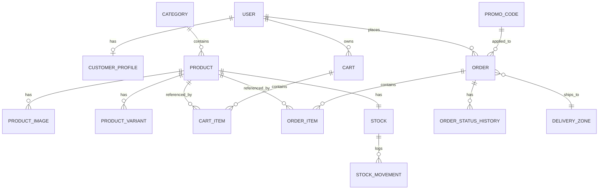

# Database Design — BioHarvest MVP

## ERD

## Models

### User
- id, email(unique), phone, password_hash, role(enum: CUSTOMER/STAFF/ADMIN), is_active, created_at
- index: email (unique), phone
- проблема: email как login — нужен CITEXT или lower(email)-index, иначе дубли с разным регистром

### CustomerProfile
- user_id(FK, unique), full_name, default_address, city
- 1:1 с User

### Category
- id, name, slug(unique), parent_id(self FK, nullable — на будущее подкатегорий)
- index: slug

### Product
- id, category_id(FK), name, slug(unique), sku(unique), description,
  price(numeric, не float!), currency='KGS', is_active, created_at
- index: slug, sku, category_id
- constraint: price >= 0
- проблема: изменение price не должно ретроактивно менять OrderItem — цена
  копируется при заказе (см. Order Item ниже)

### ProductImage
- id, product_id(FK), url, sort_order, is_primary
- index: product_id

### ProductVariant
- id, product_id(FK), name (например, "1кг"/"5кг"), sku(unique), price_delta, is_active
- MVP: минимальная реализация, без сложных комбинаций атрибутов

### Cart / CartItem
- Cart: id, user_id(FK, nullable для guest — либо MVP требует auth для cart, решить в ADR),
  created_at
- CartItem: id, cart_id(FK), product_id(FK), variant_id(FK nullable), quantity
- constraint: quantity > 0
- unique: (cart_id, product_id, variant_id) — не дублировать строку, а инкрементить qty

### Order / OrderItem / OrderStatusHistory
- Order: id, user_id(FK), status(enum), delivery_zone_id(FK), delivery_price,
  subtotal, discount_total, total, idempotency_key(unique), created_at
- OrderItem: id, order_id(FK), product_id(FK), product_name_snapshot,
  unit_price_snapshot, quantity, line_total
  — **unit_price_snapshot обязателен**: цена фиксируется на момент заказа,
    изменение Product.price не влияет на существующие заказы
- OrderStatusHistory: id, order_id(FK), status, changed_by, changed_at, comment
- index: user_id, idempotency_key(unique), status
- constraint: total = subtotal - discount_total + delivery_price (проверяется в service, не в БД)

### Stock / StockMovement
- Stock: id, product_id(FK, unique), current_stock, reserved_stock
  (available_stock = current_stock - reserved_stock, вычисляется, не хранится отдельным полем
  либо хранится как generated column для быстрых запросов/фильтров "in stock")
- StockMovement: id, product_id(FK), type(enum: IN/OUT/RESERVE/RELEASE/ADJUSTMENT),
  quantity, reference_order_id(nullable FK), created_at, created_by
- constraint: current_stock >= 0, reserved_stock >= 0, reserved_stock <= current_stock
- index: product_id, reference_order_id

### Delivery
- DeliveryZone: id, name, region, base_price
- DeliveryMethod: id, zone_id(FK), type(enum: pickup/courier/regional), price, eta_days

### PromoCode
- id, code(unique), discount_type(enum: percent/fixed), value, valid_from, valid_to,
  max_uses, used_count, is_active
- constraint: used_count <= max_uses (проверяется в service под транзакцией)

### Notification
- id, user_id(FK), type, payload(jsonb), status(enum: pending/sent/failed), created_at

### AuditLog
- id, actor_id(FK), action, entity_type, entity_id, before(jsonb), after(jsonb), created_at
- index: entity_type + entity_id, actor_id

## Stock concurrency — сценарий "1 товар, 2 покупателя"

1. На складе `current_stock=1, reserved_stock=0` → `available=1`.
2. User A и User B одновременно шлют `POST /orders`.
3. Оба запроса открывают транзакцию и делают
   `SELECT ... FOR UPDATE` на строку Stock конкретного product_id
   (row-level lock, не lock всей таблицы).
4. Запрос A получает лок первым: перечитывает `available_stock`, видит `1`,
   инкрементит `reserved_stock` до `1`, создаёт `StockMovement(RESERVE)`,
   коммитит транзакцию → лок снимается.
5. Запрос B, который ждал лока, теперь видит `current_stock=1, reserved_stock=1`
   → `available=0` → возвращает `PRODUCT_OUT_OF_STOCK`, транзакция откатывается,
   ничего не создаётся.
6. Если Order A позже отменяется — `reserved_stock` уменьшается через
   `StockMovement(RELEASE)`, товар снова доступен.

Итог: не "оптимистичная" проверка "SELECT потом UPDATE" (гонка), а
пессимистичная блокировка строки на время резервирования — единственный
надёжный способ гарантировать отсутствие oversell при двух одновременных запросах.
